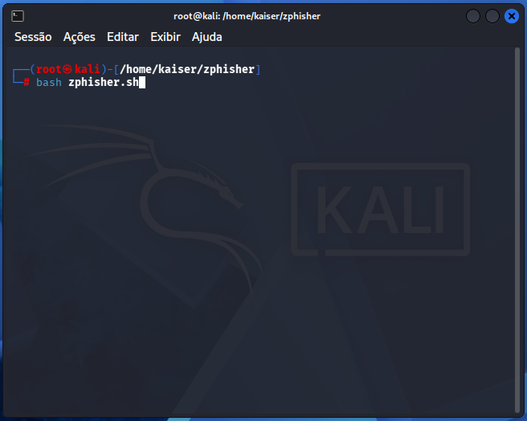
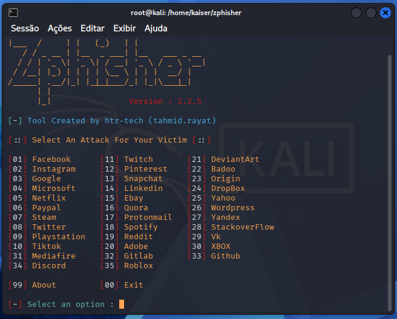
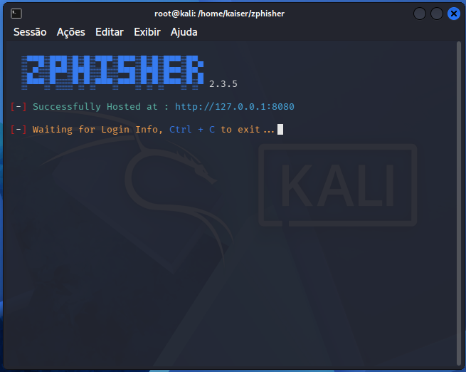
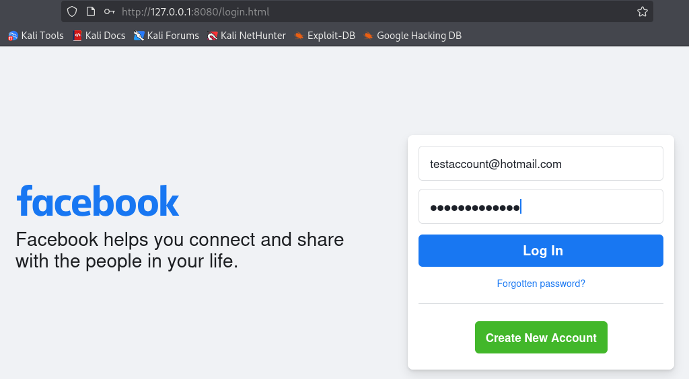
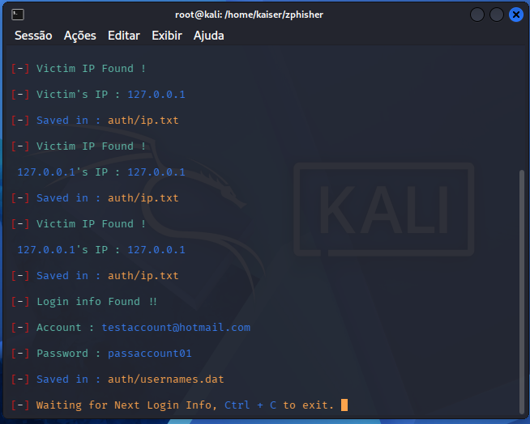

# 🎣 Phishing Awareness Laboratory with Zphisher

> Educational cybersecurity laboratory developed as part of the **Digital Innovation One (DIO)** challenge to study phishing techniques, social engineering, and defensive awareness in a controlled environment.

---

# 📖 About the Project

This repository documents a cybersecurity laboratory focused on understanding phishing attacks using **Zphisher** in an isolated and authorized environment.

The objective is to analyze phishing techniques from a defensive perspective, helping cybersecurity professionals recognize attack patterns, improve detection capabilities, and strengthen security awareness.

> **Disclaimer:** This project was conducted exclusively in a controlled laboratory environment for educational purposes.

---

# 🎯 Objectives

* Understand phishing attack concepts.
* Study social engineering techniques.
* Learn the basic workflow of Zphisher.
* Practice technical documentation with Markdown.
* Organize a cybersecurity project using GitHub.
* Promote cybersecurity awareness and defensive thinking.

---

# 🛠 Technologies Used

* Kali Linux
* Zphisher
* Git
* GitHub
* Markdown

---

# 📚 Topics Covered

* Social Engineering
* Phishing Awareness
* Credential Harvesting Concepts
* Information Security
* Ethical Hacking
* Cybersecurity Awareness

---

# 📂 Repository Structure

```text
.
├── README.md
├── DISCLAIMER.md
├── LICENSE
├── docs/
│   └── notes.md
└── images/
    ├── 01-kali-linux.png
    ├── 02-zphisher.png
    ├── 03-laboratory.png
    ├── 04-demonstration-page.png
    └── 05-results.png
```

---

# 📸 Laboratory Screenshots

## 1. Kali Linux Environment

<p align="center">
  
</p>

---

## 2. Zphisher Interface

<p align="center">
  
</p>

---

## 3. Laboratory Environment

<p align="center">
  
</p>

---

## 4. Demonstration Page

<p align="center">
  
</p>

---

## 5. Laboratory Results

<p align="center">
  
</p>

---

# 📖 Learning Outcomes

This project provided practical experience with:

* Understanding phishing attack workflows.
* Recognizing common social engineering techniques.
* Identifying phishing indicators.
* Writing clear technical documentation.
* Organizing cybersecurity projects using GitHub.

---

# 🔒 Security Considerations

Phishing remains one of the most prevalent cyber threats targeting individuals and organizations.

Recommended defensive practices include:

* Multi-Factor Authentication (MFA)
* Security awareness training
* Password managers
* URL verification
* Email security controls
* Continuous monitoring
* User education

---

# ⚠ Disclaimer

This repository is intended exclusively for educational and research purposes.

All demonstrations were performed in an isolated laboratory environment with proper authorization.

No production systems, third-party services, or real user credentials were targeted.

For additional information, see the **DISCLAIMER.md** file.

---

# 📚 References

* Digital Innovation One (DIO)
* OWASP
* MITRE ATT&CK Framework
* Kali Linux Documentation
* GitHub Documentation

---

# 👨‍💻 Author

Developed as part of the **Digital Innovation One (DIO)** Cybersecurity Challenge.

**GitHub:** https://github.com/marcio-marine-corps-soldier

---

# ⭐ Conclusion

This repository demonstrates:

* Professional technical documentation.
* GitHub project organization.
* Understanding of phishing concepts.
* Social engineering awareness.
* Ethical cybersecurity practices.
* Responsible security research.
